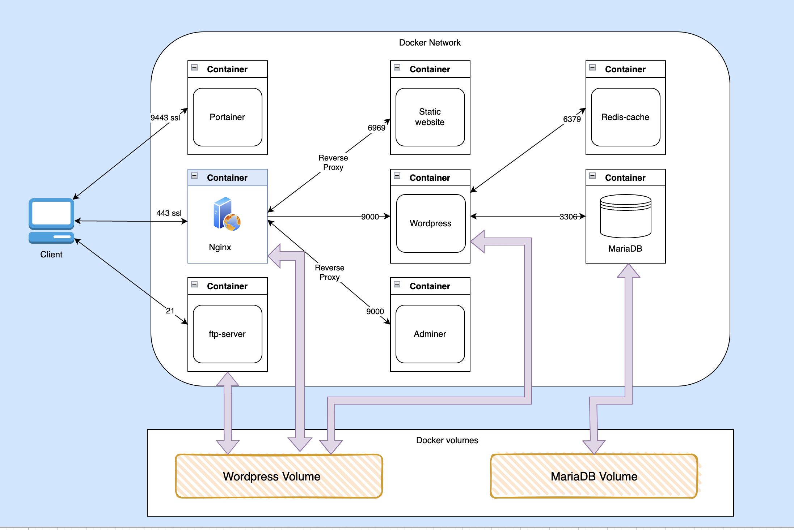

# Inception
### Overview 
- The project involves creating a comprehensive WordPress infrastructure using Docker containers for multiple services, aiming to achieve microservices architecture for this infrastructure.

### What I use in this project?

- Wordpress using wp-cli
- Nginx
- mariadb
- PHP-FPM
- OpenSSL
- Docker and Docker compose
- Redis-cache
- Portainer
- Adminer
- FTP server

#### Wordpress:
- It's a simple container when i use the wp-cli (command line interface) to download and install the worpress core (wordpress content files), and configuring wordpress to connect and use the database [MariaDB](#MariaDB) and install and connect to [Redis-cache](#Redis-cache) plugin.

#### MariaDB
- MariaDB it's a relational database management system that use as a database for wordpress, MariaDB is a robust, high-performance, and feature-rich alternative to MySQL. Its open-source nature, compatibility with MySQL, active development, and enterprise-grade features make it a compelling choice for both small and large-scale applications.

#### Nginx
- It's the web server that I use to serve the WordPress content files, all using the HTTPS protocol for an encrypted connection with the clients via [OpenSSL](#OpenSSL) (TLSv1.2, TLSv1.3). The SSL certificate is configured with Nginx. Additionally, I use a reverse proxy to connect to Adminer and the static-website services without exposing their ports. This setup helps maintain HTTPS encryption and allows for redirection and connection to Portainer via a specific domain name and port.

#### PHP-FPM
- PHP-FPM (PHP FastCGI Process Manager) is a CGI (Common Gateway Interface) that I use to handle incoming requests with PHP files in [Nginx](#Nginx) locations. It works as a separate process manager for PHP, allowing better resource management, improved performance, and scalability for serving PHP-based web applications.

#### OpenSSL
- OpenSSL is a widely-used open-source toolkit that provides implementations of SSL and TLS protocols. In my case, I utilized it to generate a self-signed certificate, which I then use in the Nginx server to establish secure connections with clients. This ensures that data exchanged between the server and clients is encrypted and secure, enhancing overall communication security and trust.

#### Docker and Docker-compose
- The core of this project is to use Docker containers to create the infrastructure in a microservices architecture. In this setup, each service runs independently in its own container. For example, if the Redis cache container exits due to any reason, the website will still be available to clients. Docker manages the dependencies and security rules for secure running of these containers. Docker Compose is used for building and orchestrating all these containers with a single Compose YAML file, Docker Deep Dive was a great book for me to undestand docker and docker-compose [Book link](./DDD.pdf).

#### Redis-cache
- Redis is an open-source, in-memory data structure store that can be used as a database, storing data in a key-value format. This makes it a high-speed database, suitable for caching purposes. Caching is a computing technique that involves temporarily storing frequently accessed data or resources in a location that allows faster access.

#### Portainer
- Portainer is an open-source management platform for Docker containers. It provides a user-friendly interface that allows users to easily manage Docker environments, including managing containers, images, volumes, networks, and more. 

#### FTP server
- FTP (File Transfer Protocol) server is a software application that facilitates the transfer of files between computers over a network. It allows users to upload, download, and manage files and directories on a remote server using FTP client software. In my case I use it with Wordpress volume.